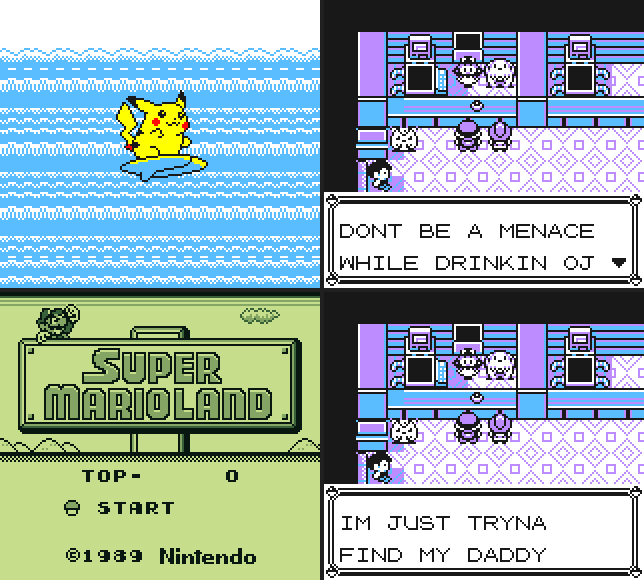

# SameBoy MCP Server

A Model Context Protocol (MCP) server that provides AI agents with full access to Game Boy and Game Boy Color emulation via the [SameBoy](https://sameboy.github.io/) emulator.



## Features

- **Memory Inspection**: Read/write any memory address, monitor changes, compare snapshots
- **CPU Control**: Access registers, set breakpoints, trace execution, disassemble code
- **Display**: Capture screenshots, get sprite/OAM data, **live display window**
- **Save States**: Create, load, and manage save states
- **Input Simulation**: Press buttons, hold keys, simulate input sequences
- **Debugging**: Breakpoints, execution tracing, memory monitoring

## Quick Start

### Prerequisites

- Python 3.10+
- Built libsameboy shared library (see [Installation](docs/INSTALLATION.md))

### Installation

```bash
# Install core dependencies
pip install mcp cffi pillow

# Optional: Live display support
pip install pysdl2 pysdl2-dll

# Build libsameboy
cd sameboy_src/SameBoy-1.0.2
make lib CONF=release
```

### Usage

```bash
# Run the MCP server
python -m sameboy_mcp.server --lib path/to/libsameboy.so --rom path/to/game.gb
```

### MCP Configuration

Add to your Claude Code settings:

```json
{
  "mcpServers": {
    "sameboy": {
      "command": "python",
      "args": ["-m", "sameboy_mcp.server", "--lib", "/path/to/libsameboy.so"],
      "cwd": "/path/to/project_sameboy"
    }
  }
}
```

## Live Display

Watch the emulator in real-time with the SDL2 display window:

```python
# Enable live display via MCP tool
await enable_live_display(scale=2)

# Run emulation - frames appear in window
await run_frames(600)

# Close when done
await disable_live_display()
```

**Controls:**
- Arrow keys: D-pad
- Z: A button
- X: B button
- Enter: Start
- Shift: Select

## Documentation

### Reference

- [Installation Guide](docs/INSTALLATION.md)
- [API Reference](docs/API.md)
- [Architecture](docs/ARCHITECTURE.md)
- [Examples](docs/EXAMPLES.md)
- [Testing](docs/TESTING.md)

### Pokemon Yellow Agent

Technical deep-dives into the Pokemon Yellow MCP agent and its subsystems:

- [RAM Vision](docs/RAM_VISION.md) — Reading game screens from memory instead of screenshots, plus the ASCII map renderer
- [The Nro of Pokemon](docs/THE_NRO_OF_POKEMON.md) — Map/tile/block hierarchy, collision, warps, sprites, and the rendering pipeline
- [Grab Da Potion](docs/GRAB_DA_POTION.md) — Complete MCP workflow: withdrawing an item from the PC using only RAM-based text decoding
- [Where Am I Bro](docs/WHERE_AM_I_BRO.md) — Finding and reading signs by memory address lookup

### Walkthrough

- [Don't Be a Menace to Pallet Town](docs/ADVENTURE_AHH_TIME.md) — A full adventure walkthrough demonstrating inventory hacking, Pokemon injection, warp table hijacking, and VRAM text injection through MCP tools

## Example Use Cases

- **Game Analysis**: Find where games store health, score, position
- **Reverse Engineering**: Trace code execution, disassemble routines
- **Automated Testing**: Script input sequences, verify game state
- **AI Game Playing**: Let AI agents observe and interact with games
- **ROM Hacking**: Modify memory, test patches in real-time

## Project Structure

```
project_sameboy/
├── sameboy_mcp/               # MCP server implementation
│   ├── emulator/              # libsameboy wrapper
│   │   ├── bindings.py        # cffi declarations
│   │   ├── core.py            # Emulator class
│   │   ├── thread.py          # Background execution
│   │   └── display.py         # SDL2 live display
│   ├── tools/                 # MCP tool modules
│   └── server.py              # MCP entry point (supports --plugin)
├── examples/
│   └── pokemon_agent/         # Pokemon Yellow AI agent
│       ├── mcp_plugin.py      # Game-specific MCP tools (text decoder, ASCII map)
│       ├── main.py            # Agent entry point
│       ├── memory_map.py      # WRAM addresses & character encoding
│       ├── game_state.py      # State reading & mode detection
│       ├── routines.py        # BFS pathfinding & game interaction
│       ├── area_analyzer.py   # MCP-driven area analysis
│       └── saved_states/      # Pre-captured game states
├── sameboy_src/               # SameBoy source code
└── docs/                      # Documentation & walkthroughs
```

## Contributors

- **Larry H** (Dartmouth College) - Primary author
- **Way Barrios** (@waybarrios) - AI Wizard

## License

This project is licensed under the MIT License.

The SameBoy emulator is developed by [Lior Halphon](https://github.com/LIJI32/SameBoy) and is licensed under the MIT License.

## Acknowledgments

- [SameBoy](https://sameboy.github.io/) - Accurate Game Boy/GBC emulator
- [Model Context Protocol](https://modelcontextprotocol.io/) - AI agent integration protocol
- [PySDL2](https://pysdl2.readthedocs.io/) - SDL2 bindings for Python
